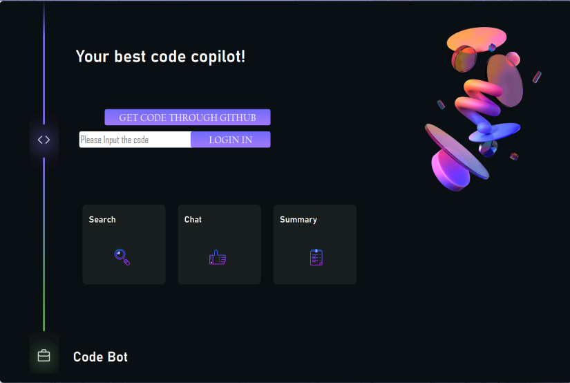
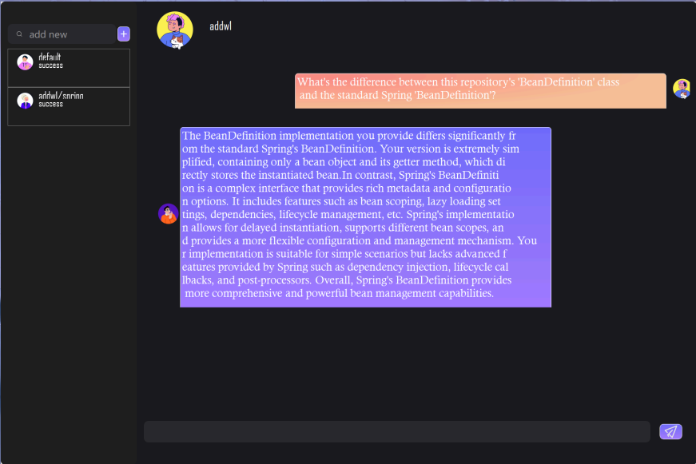

   
 

# MatrixAI Bot

This project aims to develop a github repository dialogue bot. After the user inputs the corresponding URL of the repository, the robot can answer the relevant information about the repository and help the user learn to use the corresponding repository. The system design uses a hybrid framework of **springboot** + **Flask**. At the same time, based on **matrix one** to complete the vector storage && retrieval to build a local knowledge base.

### Why matrix one?

MatrixOne's HSTAP database technology combined with Dell ObjectScale's scalable object storage provides a powerful platform for AI-generated content (AIGC). The solution's high performance and scalability enables organisations to quickly and efficiently train and deploy AI models to accelerate the generation of valuable insights and content

## 💪  Function Introduction

### 💬 Chat

**Multi-turn conversation support:** Helps you learn continuously and optimize dialogue content in ongoing interactions.  
**Repository selection feature:** Allows you to choose different knowledge repositories to obtain the most relevant responses. 
**Repository learning** :briefcase:: Enhances the bot's understanding of repository content by incorporating RAG (Retrieval-Augmented Generation) technology, thereby providing more accurate answers. 

### :card_file_box: Repo management
**One-Click Upload**: Easily upload your repository, quickly activate GPT's Quantum Speed Reading feature, and let the intelligent assistant quickly process and analyse the data for you.:fire: 

### 📜 Chat History

**Bot Memory Module**: based on sliding window 🪟, allows AI to maintain long term memory during multiple rounds of dialogue.

##  Backend

💥 **technology stack** **springboot**, **mybatis plus**, **matrix one**, **spring security**, **redis**, **mysql**, **flask**,**kafka**  
  <code></code><code></code>  <code></code> <code></code>

